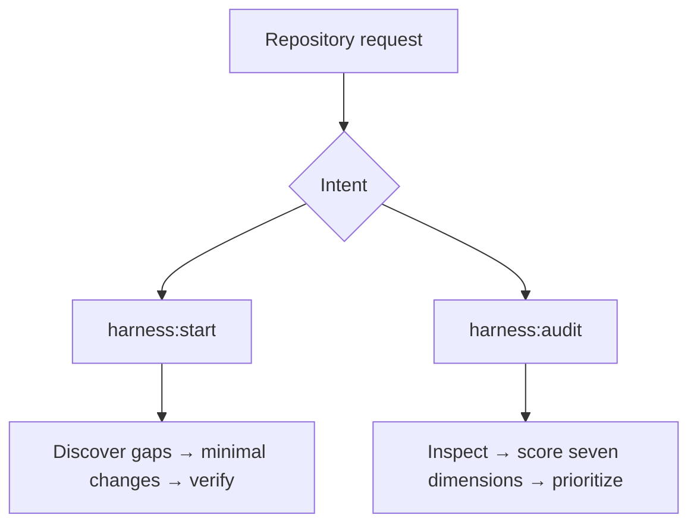

# Repo Harness

Vendor-neutral Agent Skills for bootstrapping and auditing the engineering
harness around a software repository.

Repo Harness helps an unfamiliar human or coding agent understand where to
work, which constraints apply, how to get useful feedback, and how to verify a
change safely.

| Skill | Purpose |
| --- | --- |
| `harness:start` | Bootstrap or improve a repository harness |
| `harness:audit` | Evaluate an existing repository harness |

## How it works

An engineering harness is the context, constraints, workflows, feedback loops,
and verification infrastructure around a codebase. Repo Harness evaluates
those capabilities rather than checking for particular filenames.



The two skills share an evidence-first approach but have distinct
responsibilities: `harness:start` can carry an explicitly requested plan
through implementation and safe verification, while `harness:audit` stops at
evidence-backed findings and prioritized improvements.

### `harness:start`

Bootstrap or improve the minimum useful harness for the current repository.
Discovery comes before questions; existing conventions and sources of truth
are reused before new files, commands, or documentation are proposed.

### `harness:audit`

Evaluate how safely and efficiently an unfamiliar human or coding agent can
understand, modify, and verify the repository. Audits are non-mutating and
static by default; safe runtime validation is optional only when explicitly
requested. Findings are not implemented by the audit skill.

## Audit dimensions

| Dimension | Question it answers |
| --- | --- |
| **Context** | Can an unfamiliar contributor understand the project and its domain? |
| **Navigation** | Can they find where a change belongs and where deeper context lives? |
| **Constraints** | Can they discover invariants, boundaries, generated files, migrations, and risky areas? |
| **Verification** | Can they prove a change works and matches repository expectations? |
| **Feedback Loops** | Does the repository provide fast, useful, reproducible feedback? |
| **Operational Understanding** | Can they run and debug the project at the level its scope requires? |
| **Agent Readiness** | Can a coding agent make and verify a safe, bounded change? |

## Principles and safety

- Discover before asking.
- Use evidence before assumptions.
- Evaluate capabilities, not file presence.
- Prefer executable knowledge and one source of truth.
- Preserve existing conventions and minimize harness surface area.
- Do not perform a generic code review.
- `harness:audit` is non-mutating by default.
- `harness:start` may modify the repository only when requested.
- Both skills classify a command and its full chain before execution.
- Unsafe, destructive, credentialed, externally side-effectful, or unclear
  operations are not run automatically.
- Commands that deploy, publish, alter production or shared state, require
  credentials, or have unclear effects require approval or an explicit report
  that runtime verification was not executed.
- If verification is skipped or blocked, it is never reported as passing.

## Skill structure

```text
repo-harness/
├── .claude-plugin/plugin.json
├── .codex-plugin/plugin.json
├── gemini-extension.json
├── skills/
│   ├── start/
│   │   ├── SKILL.md
│   │   └── references/
│   └── audit/
│       ├── SKILL.md
│       └── references/
├── tests/
│   ├── README.md
│   ├── start/
│   └── audit/
├── docs/spec.md
├── README.md
└── LICENSE
```

The `skills/` tree is the behavioral source of truth. Each `SKILL.md`
defines one focused behavior with supporting references; the tests are
conceptual behavioral scenarios rather than a runner or fixture repository.
No particular file is mandatory: equivalent capability elsewhere in the
repository counts. The structure shown here is a map, not a required template.

## Installation

The runtime manifests identify the `harness` plugin namespace and point
runtimes at the two skills in `skills/`.

### Antigravity / Antigravity CLI

Remote installation:

```bash
agy plugin install https://github.com/amnotwallas/repo-harness
```

Local development installation:

```bash
agy plugin install /path/to/repo-harness
```

Launch the CLI with:

```bash
agy
```

The installation and namespaced invocation flow in [Usage](#usage) has been
verified end-to-end with the actual Antigravity CLI.

### Claude Code

For local development:

```bash
claude --plugin-dir /path/to/repo-harness
```

The `.claude-plugin/plugin.json` manifest validates successfully and names
the plugin namespace `harness`. The expected namespaced commands are in
[Usage](#usage); authenticated end-to-end invocation was not verified.
Persistent installation uses available marketplaces, but no marketplace name
or installation command is assumed here.

### Codex

The existing `.codex-plugin/plugin.json` package names the plugin `harness`
and points to `./skills/`.

If an existing configured Codex marketplace contains `repo-harness`, use its
`harness` entry with this selector syntax:

```text
codex plugin add harness@MARKETPLACE_NAME
```

Replace `MARKETPLACE_NAME` with that configured marketplace. This is a syntax
template, not a universally copy-paste-ready command. No direct repository URL
installation command is assumed here.

For standalone local Agent Skills usage:

```bash
mkdir -p ~/.agents/skills

ln -s /path/to/repo-harness/skills/start ~/.agents/skills/harness-start
ln -s /path/to/repo-harness/skills/audit ~/.agents/skills/harness-audit
```

## Usage

Exact command syntax depends on the runtime. The preferred namespaced commands
are available where plugin namespacing is supported; they are not universal:

```text
/harness:start
/harness:audit
```

For standalone Codex Agent Skills, use:

```text
$harness-start
$harness-audit
```

Natural-language discovery remains the universal fallback:

```text
Set up the engineering harness for this repository.

Audit the engineering harness of this repository.
```

## Behavioral tests

The conceptual scenarios in [`tests/start/`](tests/start/) and
[`tests/audit/`](tests/audit/) currently include 15 scenarios: 7 for
`harness:start` and 8 for `harness:audit`.

Each scenario is evaluated against supplied repository evidence rather than
exact wording, arbitrary scores, or a file checklist.

They cover:

- `harness:start`: healthy and minimal projects, vendor-neutral guidance,
  runtime command safety, secret-file safety, verification boundaries, and
  independence from external skills.
- `harness:audit`: poor harnesses, capability evidence, missing-path
  contracts, dependency contracts, static runtime inference, secret-file
  safety, stale documentation, and monorepos.
- Boundary behavior preventing either skill from taking the other's
  responsibility.

## Status

Early v0.1 / pre-release.

## License

Released under the [MIT License](LICENSE).
