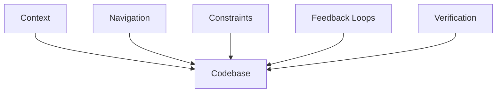
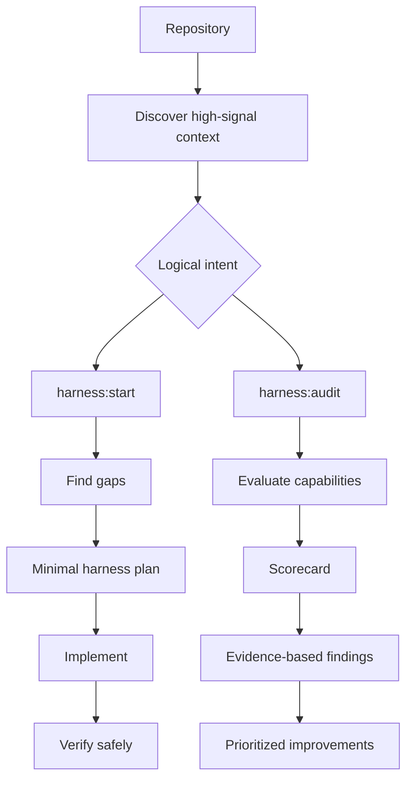

# Repo Harness

Vendor-neutral collection of Agent Skills for bootstrapping and auditing the engineering harness around a software repository.

Repo Harness helps an unfamiliar developer or coding agent understand where to work, which constraints apply, how to get useful feedback, and how to verify that a change is complete. It evaluates repository capabilities rather than checking for particular filenames.

| Skill | Purpose |
| --- | --- |
| `harness:start` | Bootstrap or improve a repository harness |
| `harness:audit` | Evaluate an existing repository harness |

## Why Repo Harness?

Repositories often contain the knowledge needed to work safely, but leave it scattered across READMEs, manifests, CI, tests, scripts, architecture notes, and tribal knowledge. The result is repeated rediscovery:

- Where does this change belong?
- Which commands define a valid change?
- What must not be edited casually?
- How does local verification compare with CI?
- What evidence shows that the work is complete?

Repo Harness improves that surrounding system without turning every repository into the same template.

## What is an engineering harness?

In this project, an engineering harness is the context, constraints, workflows, feedback loops, and verification infrastructure around a codebase that helps a human or coding agent understand, modify, and verify the project safely.

It may include developer documentation, repository navigation, architecture context, tests, linting, type checking, builds, CI, local development commands, debugging guidance, verification scripts, and important constraints. No particular file is mandatory.

The harness surrounds the codebase with the context and feedback needed to change it safely:



## How it works

`harness:start` and `harness:audit` are the two fully-qualified operations in the `harness` plugin namespace. Runtimes without plugin namespacing may expose the secondary aliases `harness-start` and `harness-audit`; natural-language discovery remains universal.



### `harness:start`

Bootstrap or improve the minimum useful harness for the current repository:

```text
discover → identify gaps → ask only necessary questions
→ propose minimal changes → implement → verify safely
```

Discovery comes before questions. Existing conventions and sources of truth are reused before new files, commands, or documentation are proposed.

### `harness:audit`

Evaluate how safely and efficiently an unfamiliar human or coding agent can understand, modify, and verify the repository:

```text
discover → inspect the existing harness → evaluate seven dimensions
→ evidence-based findings → prioritized improvements
```

Audits are static by default and never modify repository files or state. Safe local runtime validation is optional only when explicitly requested and appropriate; findings are not implemented by the audit skill.

An illustrative scorecard might look like this:

| Dimension | Score |
| --- | ---: |
| Context | 82/100 |
| Navigation | 74/100 |
| Constraints | 58/100 |
| Verification | 52/100 |
| Feedback Loops | 77/100 |
| Operational Understanding | 66/100 |
| Agent Readiness | 49/100 |
| **Overall** | **65/100** |

Scores summarize evidence; they are not scientifically precise.

## Audit dimensions

| Dimension | Question it answers |
| --- | --- |
| **Context** | Can an unfamiliar contributor understand the project and its domain? |
| **Navigation** | Can they find where a change belongs and where deeper context lives? |
| **Constraints** | Can they discover invariants, boundaries, generated files, migrations, and risky areas? |
| **Verification** | Can they prove a change works and matches repository expectations? |
| **Feedback Loops** | Does the repository provide fast, useful, reproducible feedback? |
| **Operational Understanding** | Can they run and debug the project at the level its scope requires? |
| **Agent Readiness** | Can a coding agent make and verify a safe, bounded change? |

## Principles

- Discover before asking.
- Use evidence before assumptions.
- Evaluate capabilities, not file presence.
- Prefer executable knowledge and one source of truth.
- Preserve existing conventions.
- Minimize harness surface area.
- Do not perform a generic code review.

## Example findings

These are illustrative finding shapes, not claims about this repository:

```text
[HIGH] Local verification does not match CI

Dimension: Verification
Evidence: README.md documents `pytest`, while CI runs lint, type checking, and pytest.
Why it matters: A contributor can believe a change is complete while CI rejects it.
Recommended fix: Expose one canonical local verification path containing the required checks.
```

```text
[HIGH] Migration boundary is hidden

Dimension: Constraints
Evidence: A migration-sensitive subsystem has no documented ownership or safe-change rule.
Why it matters: An agent may make a change that is difficult to review, reproduce, or recover.
Recommended fix: Document the source of truth and the smallest safe workflow at the existing ownership boundary.
```

Findings should cite repository evidence, explain impact, and recommend the smallest useful correction.

## Safety

`harness:audit` is non-mutating: it inspects repository files by default and may run safe local validation only when the user explicitly requests runtime validation. `harness:start` may modify the repository when requested, but verifies safely after changes. Both skills classify a command and its full chain before execution.

Commands that deploy, publish, mutate cloud or shared state, alter production data, perform destructive migrations, require credentialed external operations, or have unclear effects must not be executed automatically. If a command is unsafe, ask for approval or report that runtime verification was not executed. Never claim that skipped verification passed.

## Skill structure

```text
repo-harness/
├── .claude-plugin/
│   └── plugin.json
├── .codex-plugin/
│   └── plugin.json
├── gemini-extension.json
├── skills/
│   ├── start/
│   │   ├── SKILL.md
│   │   └── references/
│   │       ├── discovery.md
│   │       └── harness-patterns.md
│   └── audit/
│       ├── SKILL.md
│       └── references/
│           ├── discovery.md
│           ├── audit-rubric.md
│           └── findings.md
├── tests/
│   ├── README.md
│   ├── start/
│   └── audit/
├── docs/
│   └── spec.md
├── README.md
└── LICENSE
```

Each `SKILL.md` defines one focused behavior and stays with its supporting references. The [`tests/`](tests/) directory contains conceptual behavioral scenarios rather than a runner or fixture repository.

## Installation

Repo Harness is distributed as a collection of two Agent Skills. The `skills/` tree is the behavioral source of truth; the runtime manifests only identify the `harness` collection and point runtimes at those skills.

### Generic installation

Clone the repository:

```bash
git clone https://github.com/amnotwallas/repo-harness.git
```

For a runtime without plugin installation, place or link the two skill directories into its supported Agent Skills directory. Where symlinked aliases are supported, the secondary standalone aliases are:

```bash
ln -s /path/to/repo-harness/skills/start ~/.agents/skills/harness-start
ln -s /path/to/repo-harness/skills/audit ~/.agents/skills/harness-audit
```

These aliases are runtime-dependent compatibility helpers; the canonical operations remain `harness:start` and `harness:audit`.

### Codex

The `.codex-plugin/plugin.json` manifest identifies the collection as `harness` and points to `skills/`. Install the collection through the Codex plugin marketplace that hosts the repository.

For standalone local development, link the aliases into the supported Agent Skills directory:

```bash
ln -s /path/to/repo-harness/skills/start ~/.agents/skills/harness-start
ln -s /path/to/repo-harness/skills/audit ~/.agents/skills/harness-audit
```

### Claude Code

The `.claude-plugin/plugin.json` manifest identifies the collection as `harness`. For local development, load this checkout for a session with:

```bash
claude --plugin-dir /path/to/repo-harness
```

The preferred plugin commands are `/harness:start` and `/harness:audit`.

For standalone local development, link the aliases into Claude Code's user-level skills directory:

```bash
ln -s /path/to/repo-harness/skills/start ~/.claude/skills/harness-start
ln -s /path/to/repo-harness/skills/audit ~/.claude/skills/harness-audit
```

### Google Antigravity / Antigravity CLI

The `gemini-extension.json` manifest identifies the collection as `harness`. Install the local checkout with:

```bash
agy plugin install /path/to/repo-harness
```

The equivalent remote installation is:

```bash
agy plugin install https://github.com/amnotwallas/repo-harness
```

In the verified installation, Antigravity materializes:

```text
~/.gemini/config/plugins/harness/skills/
├── start/
│   └── SKILL.md
└── audit/
    └── SKILL.md
```

The runtime may use a different profile path in another Antigravity variant.

### Verify installation

Where plugin namespacing is supported, verify the preferred commands:

```text
/harness:start
/harness:audit
```

Natural-language discovery remains universal:

```text
Use the repo-harness skill to audit this repository.

Audit the engineering harness of this repository.

Set up the engineering harness for this repository.
```

Slash-command registration is runtime-dependent; these are not universal commands.

## Usage

Use natural-language requests such as:

```text
Set up the engineering harness for this repository.

Audit the engineering harness of this repository.
```

The namespaced operations `harness:start` and `harness:audit` are preferred wherever the installed plugin runtime supports them.

## Runtime compatibility

The skills remain vendor-neutral across Codex, Claude Code, Google Antigravity, Antigravity CLI, and other runtimes compatible with Agent Skills and `SKILL.md`. The installation notes above are limited to verified directory conventions; no runtime-specific code or integration is included.

## What Repo Harness is not

Repo Harness is not:

- a general code reviewer;
- a security scanner;
- a performance profiler;
- an LLM evaluation harness;
- an MCP server; or
- a standalone CLI.

## Behavioral tests

The conceptual scenarios in [`tests/start/`](tests/start/) and [`tests/audit/`](tests/audit/) cover:

- `harness:start` behavior for healthy and minimal projects, vendor-neutral guidance, and runtime command safety;
- `harness:audit` behavior for poor harnesses, stale documentation, monorepos, capability evidence, dependency contracts, and static runtime inference; and
- boundary behavior preventing either skill from taking the other's responsibility.

## Status

Early v0.1 / pre-release.

## License

Released under the [MIT License](LICENSE).
