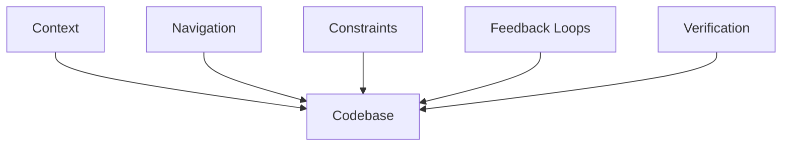
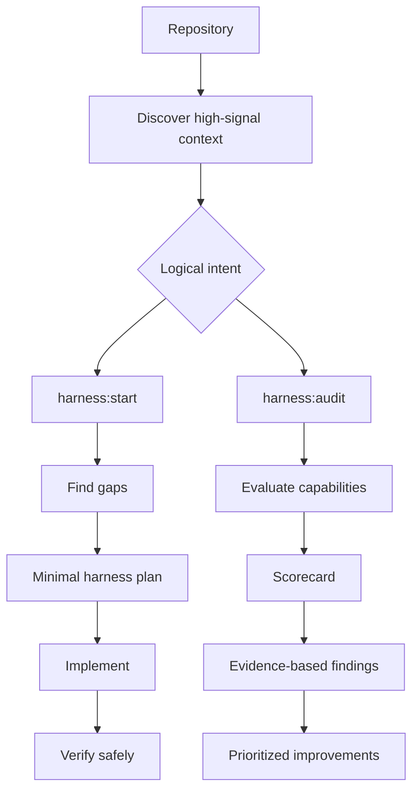

# Repo Harness

Vendor-neutral Agent Skill for bootstrapping and auditing the engineering harness around a software repository.

Repo Harness helps an unfamiliar developer or coding agent understand where to work, which constraints apply, how to get useful feedback, and how to verify that a change is complete. It evaluates repository capabilities rather than checking for particular filenames.

## Why Repo Harness?

Repositories often contain the knowledge needed to work safely, but leave it scattered across READMEs, manifests, CI, tests, scripts, architecture notes, and tribal knowledge. The result is repeated rediscovery:

- Where does this change belong?
- Which commands define a valid change?
- What must not be edited casually?
- How does local verification compare with CI?
- What evidence shows that the work is complete?

Repo Harness improves that surrounding system without turning every repository into the same template.

## What is an engineering harness?

In this project, an engineering harness is the context, constraints, workflows, feedback loops, and verification infrastructure around a codebase that helps a human or coding agent understand, modify, and verify the project safely.

It may include developer documentation, repository navigation, architecture context, tests, linting, type checking, builds, CI, local development commands, debugging guidance, verification scripts, and important constraints. No particular file is mandatory.

The harness surrounds the codebase with the context and feedback needed to change it safely:



## How it works

`harness:start` and `harness:audit` are logical intents. Actual slash-command registration depends on the runtime.



### `harness:start`

Bootstrap or improve the minimum useful harness for the current repository:

```text
discover → identify gaps → ask only necessary questions
→ propose minimal changes → implement → verify safely
```

Discovery comes before questions. Existing conventions and sources of truth are reused before new files, commands, or documentation are proposed.

### `harness:audit`

Evaluate how safely and efficiently an unfamiliar human or coding agent can understand, modify, and verify the repository:

```text
discover → inspect the existing harness → evaluate seven dimensions
→ evidence-based findings → prioritized improvements
```

Audits are static by default. Safe runtime validation is optional when explicitly requested and appropriate.

An illustrative scorecard might look like this:

| Dimension | Score |
| --- | ---: |
| Context | 82/100 |
| Navigation | 74/100 |
| Constraints | 58/100 |
| Verification | 52/100 |
| Feedback Loops | 77/100 |
| Operational Understanding | 66/100 |
| Agent Readiness | 49/100 |
| **Overall** | **65/100** |

Scores summarize evidence; they are not scientifically precise.

## Audit dimensions

| Dimension | Question it answers |
| --- | --- |
| **Context** | Can an unfamiliar contributor understand the project and its domain? |
| **Navigation** | Can they find where a change belongs and where deeper context lives? |
| **Constraints** | Can they discover invariants, boundaries, generated files, migrations, and risky areas? |
| **Verification** | Can they prove a change works and matches repository expectations? |
| **Feedback Loops** | Does the repository provide fast, useful, reproducible feedback? |
| **Operational Understanding** | Can they run and debug the project at the level its scope requires? |
| **Agent Readiness** | Can a coding agent make and verify a safe, bounded change? |

## Principles

- Discover before asking.
- Use evidence before assumptions.
- Evaluate capabilities, not file presence.
- Prefer executable knowledge and one source of truth.
- Preserve existing conventions.
- Minimize harness surface area.
- Do not perform a generic code review.

## Example findings

These are illustrative finding shapes, not claims about this repository:

```text
[HIGH] Local verification does not match CI

Dimension: Verification
Evidence: README.md documents `pytest`, while CI runs lint, type checking, and pytest.
Why it matters: A contributor can believe a change is complete while CI rejects it.
Recommended fix: Expose one canonical local verification path containing the required checks.
```

```text
[HIGH] Migration boundary is hidden

Dimension: Constraints
Evidence: A migration-sensitive subsystem has no documented ownership or safe-change rule.
Why it matters: An agent may make a change that is difficult to review, reproduce, or recover.
Recommended fix: Document the source of truth and the smallest safe workflow at the existing ownership boundary.
```

Findings should cite repository evidence, explain impact, and recommend the smallest useful correction.

## Safety

Static audits inspect repository files only. Runtime audits may run existing local validation—such as tests, lint, type checks, builds, or a canonical verification command—only after the command and its full chain are classified as safe.

Commands that deploy, publish, mutate cloud or shared state, alter production data, perform destructive migrations, require credentialed external operations, or have unclear effects must not be executed automatically. If a command is unsafe, ask for approval or report that runtime verification was not executed. Never claim that skipped verification passed.

## Skill structure

```text
repo-harness/
├── README.md
├── LICENSE
├── SKILL.md
├── docs/
│   └── spec.md
├── references/
│   ├── audit-rubric.md
│   ├── discovery.md
│   ├── findings.md
│   └── harness-patterns.md
└── tests/
    ├── README.md
    └── scenarios/
        ├── healthy-project.md
        ├── minimal-library.md
        ├── monorepo.md
        ├── poor-harness.md
        ├── runtime-command-safety.md
        ├── stale-docs.md
        └── vendor-specific.md
```

[`SKILL.md`](SKILL.md) defines agent behavior. The [`references/`](references/) directory provides detailed discovery, scoring, findings, and harness-pattern guidance. The [`tests/scenarios/`](tests/scenarios/) directory contains conceptual behavioral scenarios rather than a runner or fixture repository.

## Installation

Repo Harness is distributed as an Agent Skill: keep [`SKILL.md`](SKILL.md) together with its supporting [`references/`](references/) directory. It is not a standalone package or executable.

### Generic installation

Clone the repository, then place or link the complete `repo-harness/` directory into a runtime-supported Agent Skills directory:

```bash
git clone https://github.com/amnotwallas/repo-harness.git
```

### Codex

Place or link `repo-harness/` in the shared `~/.agents/skills/` Agent Skills directory. If your Codex environment configures a different skills directory, use that directory instead.

For local development, link the repository directly:

```bash
ln -s /path/to/repo-harness ~/.agents/skills/repo-harness
```

### Claude Code

Claude Code's user-level Agent Skills directory is `~/.claude/skills/`. Place or link `repo-harness/` there with `SKILL.md` at the skill root.

For local development, link the repository directly:

```bash
ln -s /path/to/repo-harness ~/.claude/skills/repo-harness
```

### Google Antigravity / Antigravity CLI

No exact installation path is verified for Antigravity or its CLI. Place or link `repo-harness/` into the Agent Skills directory supported by your Antigravity runtime; keep `SKILL.md` and `references/` together.

### Verify installation

After installation, try a natural-language request such as:

```text
Use the repo-harness skill to audit this repository.
```

The runtime may expose this request through its own interface. `harness:start` and `harness:audit` remain logical intents, not universally registered slash commands.

## Usage

After installation, use natural-language requests such as:

```text
Set up the engineering harness for this repo.

Check whether this repository is agent-ready.
```

The corresponding logical intents are `harness:start` and `harness:audit`. How those intents are exposed depends on the runtime.

## Runtime compatibility

The skill remains vendor-neutral across Codex, Claude Code, Google Antigravity, Antigravity CLI, and other runtimes compatible with Agent Skills and `SKILL.md`. The installation notes above are limited to verified directory conventions; no runtime-specific code or integration is included.

## What Repo Harness is not

Repo Harness is not:

- a general code reviewer;
- a security scanner;
- a performance profiler;
- an LLM evaluation harness;
- an MCP server; or
- a standalone CLI.

## Behavioral tests

The conceptual scenarios in [`tests/scenarios/`](tests/scenarios/) cover:

- a healthy project that needs no unnecessary artifacts;
- a poor harness with reasonable source code;
- stale documentation contradicting executable configuration;
- useful vendor-specific instructions that should be reused;
- root and workspace concerns in a monorepo;
- proportional behavior for a minimal library; and
- runtime command safety when a canonical command has external side effects.

## Status

Early v0.1 / pre-release.

## License

Released under the [MIT License](LICENSE).
